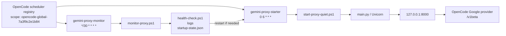

# Gemini Proxy Source of Truth

Last verified: 2026-05-26

This document is the short operational map for the local Gemini proxy setup.

## What is authoritative

- **OpenCode scheduler is the source of truth** for starting and monitoring the proxy.
- The legacy hand-created Windows tasks were removed:
  - `GeminiAPIKeyRotator`
  - `GeminiProxyMonitor`
- OpenCode routes Google provider traffic through the local proxy at:
  - `http://127.0.0.1:8000/v1beta`

## Easy-to-follow flow

## Scheduler jobs in play

| Job | Schedule | Purpose | Script |
|---|---:|---|---|
| `gemini-proxy-starter` | `0 6 * * *` | Start proxy in headless mode | `C:\Users\DaveWitkin\.local\gemini-proxy\start-proxy-quiet.ps1` |
| `gemini-proxy-monitor` | `*/30 * * * *` | Check health, errors, and restart if needed | `C:\Users\DaveWitkin\.local\gemini-proxy\monitor-proxy.ps1` |

## Key inventory

Source files checked:

- `C:\Users\DaveWitkin\.local\gemini-proxy\api_keys.txt`
- `C:\Users\DaveWitkin\.local\gemini-proxy\key_names.json`
- targeted scans in `C:\Users\DaveWitkin\.config\opencode` and `C:\development\opencode\docs`

### Current keys in `api_keys.txt`

| Slot | Key preview | Friendly label found? | Notes |
|---|---|---|---|
| 1 | `AIzaSyDnMbf5...` | No | Present in `api_keys.txt`; no name match found in `key_names.json` or targeted `.env` scan |
| 2 | `AIzaSyDAacPF...` | Yes | `Dave PA for OC` |
| 3 | `AIzaSyBK3hWn...` | No | Present in `api_keys.txt`; no name match found in `key_names.json` or targeted `.env` scan |
| 4 | `AIzaSyAJS1nH...` | No | Present in `api_keys.txt`; no name match found in `key_names.json` or targeted `.env` scan |
| 5 | `AIzaSyA6fQmg...` | No | Present in `api_keys.txt`; no name match found in `key_names.json` or targeted `.env` scan |

### Friendly labels currently stored in `key_names.json`

| Key preview | Friendly label |
|---|---|
| `AIzaSyDAacPF...` | `Dave PA for OC` |
| `AIzaSyCND2NS...` | `Dave Personal for OC` |
| `AIzaSyAIHoxs...` | `Raquel Personal for OC` |
| `AIzaSyDQJD_p...` | `Tiberius Personal for OC` |

## Important interpretation

- Only **one** of the five currently loaded keys has a matching friendly label.
- Three labels in `key_names.json` point to keys that are **not** present in the current `api_keys.txt` inventory.
- No `.env`-style named key mapping was found in the targeted search.
- That means the naming file looks **stale relative to the active key file** and should be treated as an inventory mismatch, not a reliable canonical source.

## Operational notes

- The proxy uses localhost only (`127.0.0.1:8000`).
- The monitor reads logs plus startup state and can restart the starter job if health degrades.
- If the user wants to reduce spend or exposure, the next review step is to decide which of the five active keys should remain in `api_keys.txt`.
