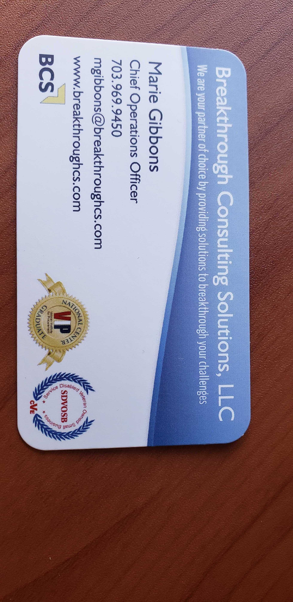
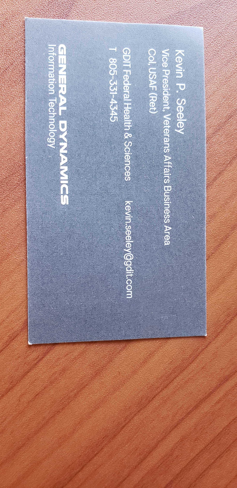
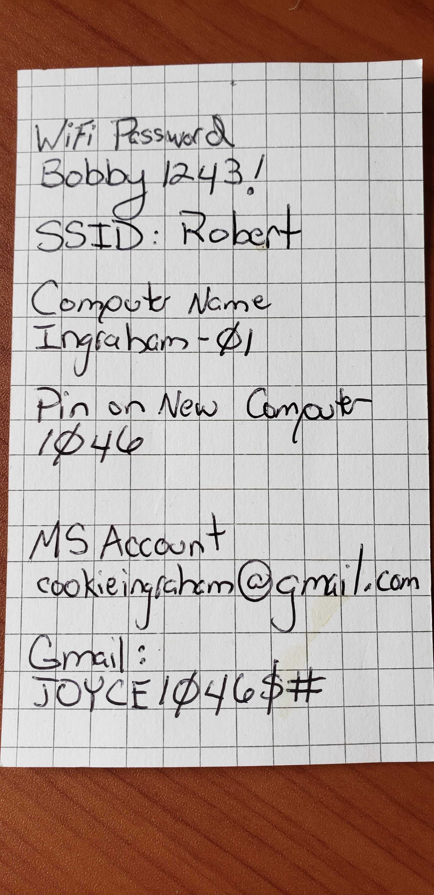
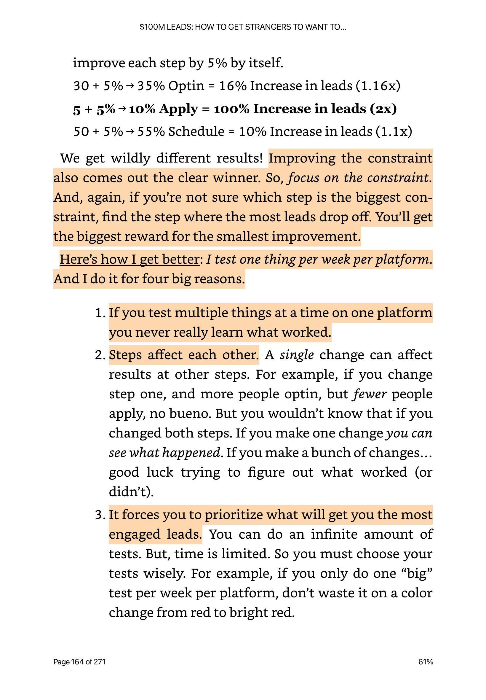
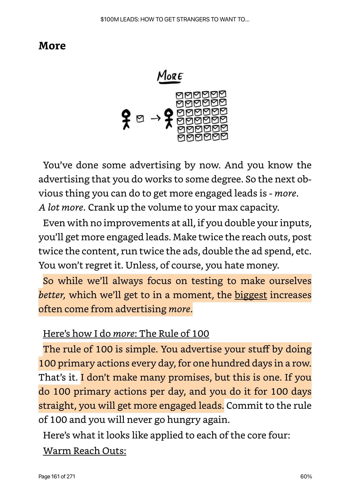
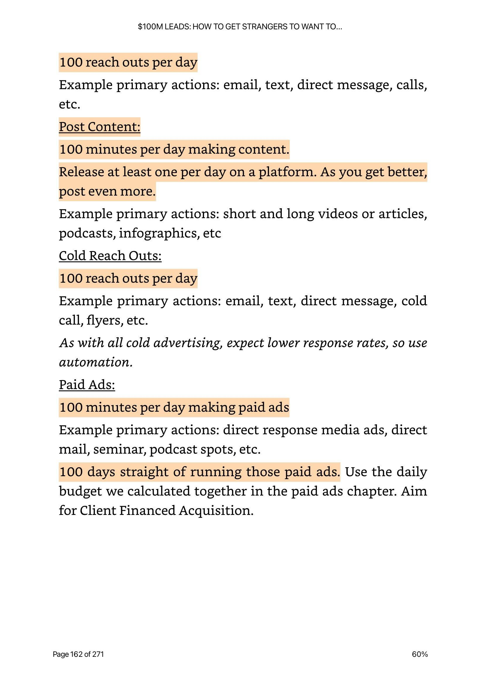

# Dave Witkin's Notes to Self (Slack Reminders)
**Source:** Slack Channel `D02UFD2NTUY`
**Extracted on:** 2026-03-12

This file contains items saved as reminders, to-dos, or things to remember from Dave's private Slack channel.

*(Note: Name corrected to Witkin)*

| Date | Description | Related Links |
| :--- | :--- | :--- |
| 2026-03-09 | **MCP Regression Test** | (None) |
| 2026-03-09 | **OpenCode MCP Smoke Test** | (None) |
| 2026-03-07 | **Idea for digital.ai Targeting** - Scrape Jira post likes/comments and cross-reference with government. Also LinkedIn members of Jira/Atlassian groups. | [digital.ai](http://digital.ai), [LinkedIn lead gen strategy](https://x.com/draprints/status/2030321649099444453?s=12) |
| 2026-02-19 | **Visualizations for Client Concepts** - Finding visuals like "Focus vs Multitasking" to help clients understand key concepts. | [Tansu Yegen Visualization](https://x.com/tansuyegen/status/2024163182063820869?s=12) |
| 2026-01-19 | **Ente Auth Codes** | [F0A9S4UUVPE_ente-auth-codes.txt](attachments/F0A9S4UUVPE_ente-auth-codes.txt) |
| 2026-01-19 | **Ente Recovery Key** | [F0A97331AB1_ente-recovery-key.txt](attachments/F0A97331AB1_ente-recovery-key.txt) |
| 2025-12-26 | **Implementation Note** - Put this into practice. | [F0A5ST6V5L4_support-tools-process.pdf](attachments/F0A5ST6V5L4_support-tools-process.pdf) |
| 2025-12-23 | **Contact Info** - Charlotte Geary | (Phone: 719-271-7902) |
| 2025-12-23 | **System Health & Privacy Auditor** - CLI idea to find leaks (passwords/SSNs) in local files. | (None) |
| 2025-12-23 | **Hidden APIs for Web Scraping** - Discovery method using Chrome DevTools MCP. | [Scraping Hidden APIs Guide](https://damimartinez.github.io/scraping-hidden-apis-chrome-mcp/) |
| 2025-12-21 | **Developer Productivity Study** - Analysis of situational barriers to flow (interruptions, time pressure, poor tools). | [LinkedIn Discussion on Flow](https://www.linkedin.com/posts/thomas-obkircher_developerexperience-productivity-activity-7407352126957432832-R3ve) |
| 2025-12-19 | **Sparki AI Video Editor** - Chat-based video editing tool. | [Sparki.io](https://sparki.io/) |
| 2025-12-18 | **Google Flow Video Refinement** - Refine content and editing in Flow. | [Google Labs Flow Blog](https://blog.google/technology/google-labs/flow-refine-videos/) |
| 2025-12-18 | **Agent Opus** - AI video generator for social media. | [Opus.pro Agent](https://www.opus.pro/agent) |
| 2025-11-05 | **Market Research Tools** - Strella (AI interviews) and Voicepanel (customer research). | [Strella](https://www.strella.io/use-case/market-research), [Voicepanel](https://www.voicepanel.com/) |
| 2025-11-05 | **AI Co-founder** - Product planning and research. | [aicofounder.com](https://aicofounder.com/) |
| 2025-10-27 | **Visual Reference (2025-10-27)** |   |
| 2025-10-14 | **Visual Reference (2025-10-14)** |  |
| 2025-09-19 | **Visual Reference (2025-09-19)** |    |
| 2025-06-19 | **AI Video Generator** - HeyGen for Brad. | [HeyGen](https://www.heygen.com/) |
